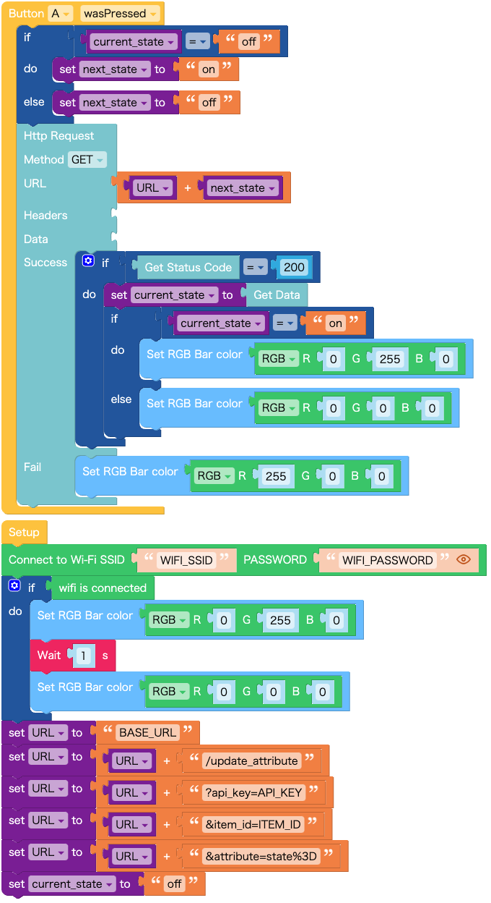

# UIFlow Examples

## Essential Concepts

### M5Stack

[M5Stack Controllers](https://docs.m5stack.com/en/products?id=core) are modular, stackable, scalable, and portable devices driven by an ESP32 core. This core is a single 2.4 GHz Wi-Fi and Bluetooth combo chip. You can seamlessly connect various sensors and actuators without soldering, thanks to the user-friendly [Units](https://docs.m5stack.com/en/products?id=sensor). Multiple development platforms and programming languages are at your disposal, including UIFlow, MicroPython, Arduino, and many others.

### UIFlow

[UIFlow](https://docs.m5stack.com/en/quick_start/m5core/uiflow) provides a visual programming environment. Once your controller is Wi-Fi connected and online, you can begin visual coding directly in your browser without any additional development tool installations.

```mermaid
sequenceDiagram
    actor User
    participant M5Stack
    participant API as API Server
    participant Firestore
  
loop Update Item Attribute
    User->>M5Stack: Press button
    M5Stack->>+API: /update_attribute
    API->>Firestore: Update item attribute
    API-->>-M5Stack: Return result
    M5Stack->>M5Stack: Refresh display and LEDs
    User-->>M5Stack: Observe update
end
```

## Contents

### Examples

#### For ATOM Controllers (e.g., ATOM LITE)

- `update_attribute_atom.mf5`: This visual script allows you to modify an attribute of an item using the `/update_attribute` endpoint.
- `get_attribute_atom.m5f`: This visual script retrieves an attribute of an item via the `/get_attribute` endpoint.

Running an Example:

1. Navigate to the UIFlow editor by visiting [https://flow.m5stack.com/](https://flow.m5stack.com/).
2. Select `UIFlow1.0` and click the `Confirm` button.
3. Enter the API key for your controller, select `ATOM LITE`, and then click the `OK` button.
4. Click the `Open` button located at the top-right corner.
5. Choose an `.mf5` file.
6. Edit parameters, such as `WIFI_SSID` or the attribute name (replace `state` before `%3D` with the real attribute name here `%3D` means `=`), and click the `Run` button to execute the code. Note that the code will be erased if the controller is powered off or reset.
7. Modify your code as needed.
8. Once finished, click the `Download` button to download the code to your controller.

### Utilities

- `remove_secrets.py`: This utility script aids in stripping out sensitive data such as `api_key`, `item_id`, `apikey`, and `uuid` from a .m5f file before repository commits.

## Instructions for Workshop Tutors

1. Refer to [the official tutorial](https://docs.m5stack.com/en/quick_start/m5core/uiflow). Using M5Burner, update the firmware of each controller to the designated version (e.g., v1.9.6 for ATOM controllers).
2. Set up Wi-Fi for each controller using M5Burner.
3. Make a note of the API key for every controller. Share this information with participants in a manner you find suitable, such as attaching a sticky note to a workshop kit box.
